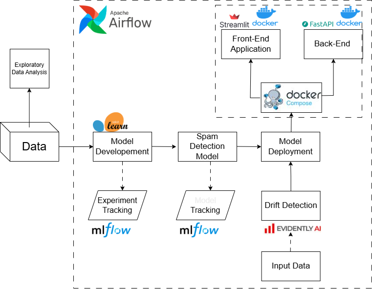

This repository contains the code collection for the end-to-end NLP Machine Learning Spam Detection project. 

### Goal
Goal of this project is to build a machine learning model that can accurately classify emails as spam or not spam. This project will use various NLP techniques and machine learning algorithms to achieve this goal. 

### Development Steps
Development steps for this project can be broken down into the following steps:

1. Exploratory Data Analysis
2. Data Preprocessing
3. Model Development with MLFlow
4. Model Evaluation with MLFlow
5. Model Deployment with Docker Compose
6. Model Maintenance with Airflow

The overall project structure would look like the following:



### Technologies Used
In this project, I would use the following technologies and tools:

1. Python
2. Jupyter Notebook
3. VS Code
4. Streamlit
5. MLFlow
6. Evidently
7. NLTK
8. Wordcloud
9. Pandas
10. Scikit-learn
11. Matplotlib
12. Seaborn
13. Docker
14. Airflow
15. FastAPI 


### Dataset

Dataset can be found at https://www.kaggle.com/datasets/purusinghvi/email-spam-classification-dataset/data?select=combined_data.csv

### Running the Project
To run the project, follow the steps below:
1. Clone the repository to your local machine.
```
git clone https://github.com/grzegorz-gomza/E-Mail_Spam_Detection.git
```
2. The best way to run this app is to use Docker. To do that, you need to have Docker installed on your machine. Once you have Docker installed, you can run the following command to build and run the Docker container:
```
docker compose -f 'docker-compose.yaml' up -d --build 
```
3. Open your Docker dashboard and you should see the container running. You can access the project by navigating to http://localhost:9000.

